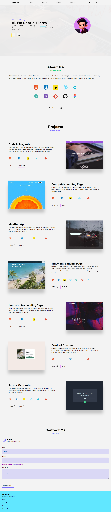

# Portfolio

Hello 🖐️ I'm Gabriel Fierro a Frontend Developer Jr

I've been learning **React js** working in different projects for the last time and I love to say that finally I've my Portfolio. It contains six projects using a lot of tools and technologies who's described below.

<h3 align="left">Languages and Tools used in the project</h3>

   

<h3>
Preview
</h3>

Now let's take a look to my Portfolio from the design that I'm created on Figma for light and dark mode.

